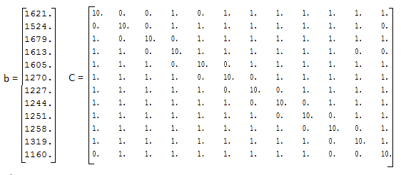
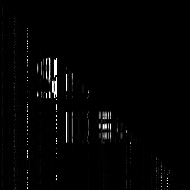
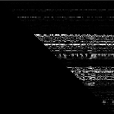
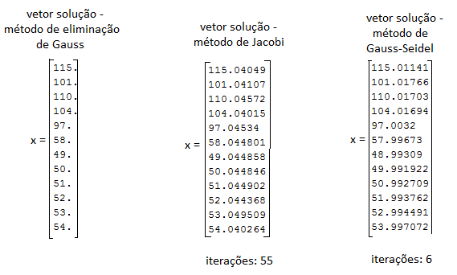

_Utilização de métodos numéricos em aplicações envolvendo criptografia._

Repositório destinado a aplicações envolvendo criptografia fazendo utilização de métodos 
numéricos, referente à atividade III de laboratório da disciplina de Computação Numérica 
(ECT2401) do curso Ciências e Tecnologia da UFRN.

## Problemas Propostos

- Criptografia de uma imagem

Fazer utilização de métodos exatos, que fornecem a solução exata com um número finito de 
operações, para realizar a criptografia de imagens, dividindo uma imagem em dois pacotes 
de informações (bytes), que carregam os dados da imagem, e simular o envio desta 
separadamente para o destino, garantindo que se alguma delas fosse interceptada a mensagem
não poderia ser identificada. Para isso, utilizou-se decomposição LU, que consiste na 
fatoração de uma matriz que é produto de duas outras matrizes triangulares.

- Descriptografia de uma mensagem

Decifrar uma mensagem contida numa matriz coluna utilizando métodos iterativos que 
obtêm a solução de um sistema com uma dada precisão através de um processo infinito 
convergente e uma sequência de aproximações. As informações pré-fornecidas foram de 
que a mensagem original foi convertida, caractere a caractere, para o formato ASCII 
e armazenadas na matriz coluna em questão ("b") , e em seguida, multiplicada por uma matriz 
de criptografia (“C”). O sistema obedece a seguinte equação: C*m = b, em que “C” é a matriz 
de criptografia com os coeficientes do sistema, “m” a mensagem original a ser obtida e “b” 
a mensagem no formato ASCII de inteiros, que represente o vetor de termos independentes. AS 
matrizes "b" e "C" fornecidas são mostradas a seguir.



Por fim, analisar qual dos métodos iterativos utilizados foi mais eficiente.


## Requisitos

- Scilab
- Biblioteca de manipulação de imagens `scicv`.


## Utilização dos métodos

####Criptografia de Imagens

No Scilab, instale a biblioteca _scicv_ (Scilab Computer Vision Module) com o comando
`atomsInstall("scicv");` , ou, se preferir, instale diretamente pela interface do 
gerenciador de módulos (ATOMS).

Em seguida, reinicie o Scilab para que a biblioteca seja carregada.

Abra também o arquivo da função de decomposição LU (o arquivo será aberto no SciNotes) 
e execute-o para que a função possa ser usada.

No console do Scilab, execute os seguintes comandos:

``` 
// inicializa os recursos que serão utilizados da biblioteca scicv
scicv_Init();

//atribue o caminho da imagem a ser criptografada a uma variável
i = imread('caminho/secret.png');
```
Imagem utilizada (tamanho (190x190)px ):


```
//trabalharemos com a imagem em preto e branco
//variável recebendo a matriz da imagem em escala cinza
ig = cvtColor(i, CV_BGR2GRAY);

//a matriz da imagem deve ser convertida de inteiros para double, a fim de que a 
//decomposição funcione corretamente
igF = double(ig(:,:));

// para garantir que a matriz da imagem não fique com duas linhas idênticas e 
portanto, não possua decomposição LU, adicione um ruído a imagem 
igF = igF + rand(dimensionX, dimensionY);

//exibindo a imagem
matplot(igF);

//Realizando a decomposição LU
[L,U] = decomposicaoLU(igF);

matplot(L);            //exibindo L
matplot(U);            //exibindo U
```
Imagens que representam as matrizes L e U geradas

 &nbsp; &nbsp; 

```
//salvando as imagens das matrizes L e U
imwrite(fullfile('caminho/img/', 'L.png'), L);
imwrite(fullfile('caminho/img/', 'U.png'), U);

//Atribuindo e exibindo o resultado da multiplicação das matrizes L e U
Result = L*U;
matplot(Result);

//Salvando a imagem da matriz resultante (matriz original)
imwrite(fullfile('caminho/img/', 'Result.png'), Result);
```
Imagem Resultante:


Obs: utilizamos a implementação do algoritmo de decomposição LU para fins didáticos, porém 
o Scilab já implementa uma função que realiza o mesmo processo implementado (**lu(A)**). Você 
pode obter mais detalhes da utilização dessa função [aqui](https://help.scilab.org/doc/6.0.0/en_US/lu.html).


####Descriptografia de mensagens

No Scilab, abra os arquivos dos métodos de _Resolução Retroativa, Eliminação de Gauss, Jacobi 
e Gauss-Seidel_ no SciNotes. Execute os arquivos para que as funções fiquem disponíveis para 
uso no Scilab.

Em seguida, abra o arquivo `pre-informations.sci` e execute-o para gerar a matriz de coeficientes 
e o vetor de termos independentes fornecidos.

Em seguida, execute os seguintes comandos para obter a solução do sistema:
```
//obtendo o vetor solução pelo método de Gauss
xGauss = gauss(C,b)

//obtendo o vetor solução e o número de iterações pelo método de Jacobi
[xJacobi, iterJ] = jacobi(C, b, zeros(12,1), 10^-3, 300)

//obtendo o vetor solução e o número de iterações pelo método de Gauss-Seidel
[xGaussSeidel, iterGS] = gaussSeidel(C, b, zeros(12,1), 10^-3, 300)
```
Com isso, obtém-se os seguintes resultados:



Baseado nesta imagem, se arredondarmos todos os valores para números inteiros e observarmos 
a [tabela _ascii_](https://www.asciitable.com/) percebe-se que a mensagem escondida é a 
frase: **senha:123456** e que, dos métodos iterativos, _Gauss-Seidel_ é o mais eficiente para
encontrar as soluções do sistema devido o baixo custo computacional (número de iterações baixo).


## Metodologia

- **Método de Decomposição LU**

O método de decomposição LU permite associar, sob determinadas condições, uma matriz 
quadrada a um produto de duas matrizes, L (Matriz triangular inferior (*Lower*)) e U 
(Matriz triangular superior (*Upper*)).

O teorema desse método diz que uma matriz **A** possui decomposição **LU** se e 
somente se os determinantes dos menores principais dessa matriz forem diferentes 
de 0 ( ), para 
k = 1,2, ... , n-1.


- **Método de Resolução Retroativa**

Método de resolução de sistemas lineares triangulares que consiste em achar o resultado 
das incógnitas do sistema um a um com base nos valores anteriores encontrados para as 
incógnitas.
Por exemplo, suponha o seguinte sistema:
```
  2x1 + 2x2 - x3 = 5
  0x1 - 2x2 - x3 = -7
  0x1 + 0x2 + 5x3 = 15
```
Utilizando resolução retroativa resolvemos promeiro o `x3` pela equação, e em seguida 
`x2`, `x1`. Isso vale para qualquer matriz de `n` incógnitas nesse formato.


- **Método de Gauss**

O método de decomposição de _Gauss_ consiste em transformar um sistema qualquer em um sistema 
triangular, permitindo, dessa forma, que este seja resolvido pelo método de resolução 
retroativa.
O método consiste em juntar a matriz dos coeficientes com o vetor solução fazendo uma matriz
aumentada, e fazer pivotação dos valores para escalonar parcialmente a matriz.


- **Método de Jacobi**

O Método de _Jacobi_ é um método iterativo que consiste em isolar as incógnitas de um sistema 
linear não-triangular de forma que deve-se calcular o valor dessas incógnitas com base numa 
solução inicial proposta e repetir o método para achar novos valores utilizando os resultados 
anteriores de cada iteração do método até que a solução convirja.


- **Método de Gauss-Seidel**

Similar ao método de _Jacobi_, o método de _Gauss-Seidel_ também isolar as incógnitas de um 
sistema linear não-triangular para achar as soluções deste. A única diferença é que, neste 
método, o valor utilizado para calcular os elementos e encontrar as variáveis, utiliza o 
valor mais atual das soluções.
 
